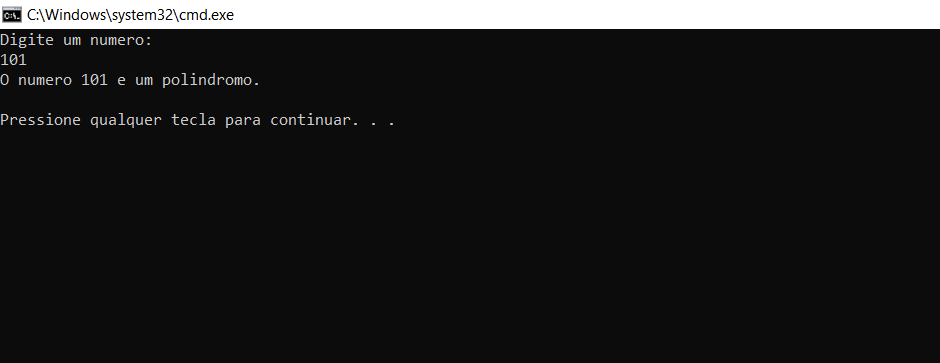

## Introdução

Neste posts temos uma lista de programas em C envolvendo operações númericas.

___

### Soma de todos os números até N

```c
#include<stdio.h>

int main(void){
    int i,n,soma=0;
    printf("Digite um numero: \n");
    scanf("%d", &n);
    for(i=0;i<=n;i++){
        soma=soma+i;
    }
    printf("A soma dos numeros e: %d\n", soma);
}
```
O resultado:


___

### Soma dos digitos de um número

```c
#include<stdio.h>

int main(void){
  int soma,n,sum=0,x;
  printf("Digite um numero: \n");
  scanf("%d", &n);
  soma=n;
  while(n>0){
    x=n%10;
    sum=sum+x;
    n=n/10;
  }
  printf("O soma de todos os digitos em %d e: %d\n",soma,sum);
}

```
O resultado:


___

### Print o reverso de um número

```c
#include<stdio.h>

int main(void){
  int inv,n,rev=0,x;
  printf("Digite um numero: \n");
  scanf("%d", &n);
  inv=n;
  while(n>0){
    x=n%10;
    rev=rev*10+x;
    n=n/10;
  }
  printf("O reverso de %d e: %d\n", inv,rev);
}


```
O resultado:


___

### Print se um número é palíndromo ou não



```c
#include<stdio.h>
int main(void){

  int poli,n,rev=0,x;
  printf("Digite um numero: \n");
  scanf("%d", &n);
  poli=n;
  while(n>0){
    x=n%10;
    rev=rev*10+x;
    n=n/10;
  }
  if(poli==rev)
  printf("O numero %d e um palindromo.\n",rev);
  else
  printf("O numero %d nao e um palindromo.\n",rev);
}
```
O resultado:


