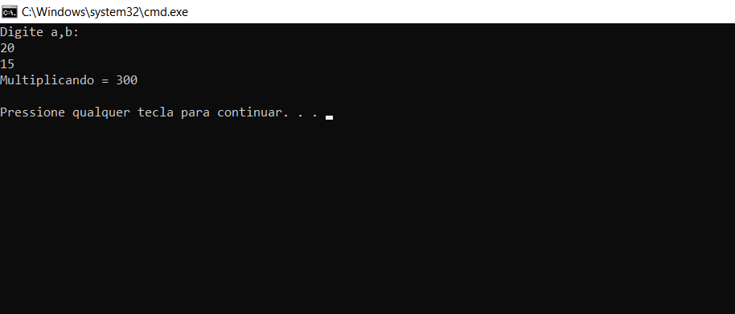

## Introdução

Neste post iniciamos uma introdução aos programas em C.

___

### Hello World

```c
#include <stdio.h>

int main(void){
  printf("Hello, World!");
  return 0;
}
```

O resultado: 


___

### Print de 1 a 100

```c 
#include<stdio.h>

int main(void){
  int i;
  for(i=1;i<=100;i++){
    printf("%d\n", i);
  }
}
```
O resultado:


___

### Print da letra A até Z
```c
#include<stdio.h>

int main(void){
  int i;
  for(i=65;i<=90;i++){
    printf("%c\n", i);
  }
}
```
O resultado:


___

### Print se um dado número é ímpar ou par

```c
#include <stdio.h>

int main(void){

  int i;
  printf("Digite um numero: \n");
  scanf("%d", &i);
  if(i % 2 == 0){
    printf("O numero %d e par", i);
  }
  else {
    printf("O numero %d e impar", i);
  }
  printf("\n");
}
```
O resultado:


___

### Print todos os números ímpares até N

```c
#include <stdio.h>
int main(void){

  int i, n;
  printf("Digite um numero: \n");
  scanf("%d", &n);
  for(i=0;i<=n;i++){
    if(i % 2 == 1)
    printf("%d\n", i);
    else
      continue;
  }
  printf("\n");
 
}
```

O resultado:


___

### Inverta dois números usando uma terceira variável

```c
#include <stdio.h>
int main(void){

  int a, b, c;
  printf("Digite a: \n");
  scanf("%d", &a);
  printf("Digite b: \n");
  scanf("%d", &b);
  printf("Os valores de a: %d e b: %d antes de trocarmos \n", a, b);
  c=a;
  a=b;
  b=c;
  printf("Os valores de a: %d a b: %d depois de trocarmos \n", a, b);
 
}
```

O resultado:


___

### Inverta dois números sem uma terceira variável

```c
#include <stdio.h>
int main(void){

  int a, b;
  printf("Digite a: \n");
  scanf("%d", &a);
  printf("Digite b: \n");
  scanf("%d", &b);
  printf("Os valores de a: %d e b: %d antes de trocarmos \n", a, b);
  a=a+b;
  b=a-b;
  a=a-b;
  printf("Os valores de a: %d a b: %d depois de trocarmos \n", a, b);
 
}
```
O resultado:

 

___

### Mostre que um ano é bissexto ou não

```c
#include <stdio.h>

int main(void){

  int ano;
  printf("Digite o ano que voce deseja: \n");
  scanf("%d", &ano);
  if(ano % 400 == 0){
    printf("%d e um ano bissexto \n", ano);
  }
  else if(ano % 100 == 0){
    printf("%d nao e um ano bissexto \n", ano);
  }
  else if(ano % 4 == 0){
    printf("%d e um ano bissexto \n", ano);
  }
  else{
    printf("%d nao e um ano bissexto \n", ano);
  }
}
```
O resultado:


___

### Converta um número de dias em Anos, Semanas e Dias

```c
#include <stdio.h>

int main(void){

  int ndias, anos, semanas, dias;
  printf("Digite o numero de dias: \n");
  scanf("%d", &ndias);
  anos = ndias / 365;
  semanas = (ndias % 365) / 7;
  dias = (ndias % 365) % 7;
  printf("%d dias = %d anos, %d semanas, %d dias \n",ndias,anos,semanas,dias);
}
```
O resultado:


___

### Ache o maior de três números

```c
#include <stdio.h>

int main(void){

  int num1, num2, num3;
  printf("Digite o numero 1: \n");
  scanf("%d", &num1);
  printf("Digite o numero 2: \n");
  scanf("%d", &num2);
  printf("Digite o numero 3: \n");
  scanf("%d", &num3);
  if((num1 > num2) && (num1 > num3)){
    printf("O numero %d e maior \n", num1);
  }
  else if((num2 > num1) && (num2 > num3)){
    printf("O numero %d e maior \n", num2);
  }
  else{
    printf("O numero %d e maior \n", num3);
  }
}
```
O resultado:


___

### Programa de Multiplicação com uso de adição

```c 
#include <stdio.h>

int main(void){

  int a, b, i, multiplicando=0;
  printf("Digite a,b: \n");
  scanf("%d%d", &a, &b);
  if(b < 0){
    a=a+b;
    b=a-b;
    a=a-b;
  }
  if(a >= 0){
    for(i=1;i<=a;i++)
    multiplicando+=b;
  }
  if(a < 0){
    for(i=a;i<=-1;i++)
    multiplicando-=b;
  }
  printf("Multiplicando = %d\n", multiplicando);
}
```
O resultado:



___

### Programa sobre Bônus no salário

Um bônus de 5% adicional aos homens, e um bônus de 10% adicional as mulheres.
O input deve conter o salário e o gênero.
Se o salário for menor do que 5000, um bônus de 2% é adicionado.

```c
#include <stdio.h>
#include <string.h>

int main(void){

  float salario, bonus;
  char genero;
  printf("Digite H para Homens e M para Mulheres: \n");
  scanf("%c", &genero);
  printf("Digite o salario: \n");
  scanf("%f", &salario);
  if(genero == 'H' || genero == 'h'){
    if(salario > 5000)
    bonus = (float)(salario * 0.05); // 5%
    else
    bonus = (float)(salario * 0.07); // 7%
  }
  if(genero == 'M' || genero == 'm'){
    if(salario > 5000)
    bonus = (float)(salario * 0.1); // 10%
    else
    bonus = (float)(salario * 0.12); // 12%
  }
  salario+=bonus;
  printf("Bonus = %.2f\nSalario = %.2f\n", bonus, salario);
}
```
O resultado: 


___ 

